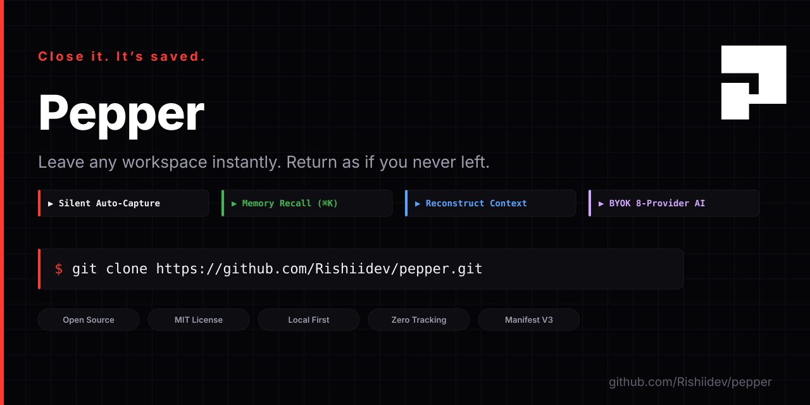

# ⚡ PEPPER OS — The Operating System for Human Memory

<div align="center">
  
  <br/><br/>

**Computers remember files. Browsers remember history. People remember ideas. Pepper remembers work.**

[](https://github.com/Rishiidev/pepper/stargazers)
[](https://github.com/Rishiidev/pepper/actions)
[](LICENSE)
[](https://github.com/Rishiidev/pepper/releases)

*Works in Chrome · Edge · Brave · Arc · Opera · Manifest V3*

</div>

> Pepper cuts context-switching downtime to 0 seconds. Leave any workspace instantly and return as if you never left.

---

## The Problem

Every day, people lose their train of thought. You're deep in research or debugging, a meeting starts, you close your window, and your momentum is destroyed. Rebuilding that context takes 15–30 minutes of manual tab hunting, re-reading docs, and context switching.

## The Fix

Pepper is the layer between humans, browsers, AI, and work. It silently observes browser context in the background. When a window closes, Pepper auto-captures all open tabs, active focus time, domain clusters, and AI summaries into a structured **Work Memory**.

When you return, press `⌘K` or click **Reconstruct Memory**—Pepper expands its geometric portal and re-hydrates your exact workspace flow in milliseconds.

```
Leave Instantly → Silent Auto-Capture → Press ⌘K → Reconstruct Context → "I'm Back."
```

---

## Key Features

- **⚡ Silent Auto-Capture**: Background service worker records open tabs, active focus time, and domain clusters on window close. Zero manual tab management required.
- **🧠 Work Memory Recall (⌘K)**: Ranked full-text search across 8 weighted fields (name, intent, summary, project, tags, domains, titles, URLs).
- **💫 Context Reconstruction Animation**: Interactive geometric portal expansion overlay when resuming work.
- **🤖 BYOK 8-Provider Intelligence Engine**: Bring your own keys for OpenAI, Anthropic, Gemini, OpenRouter, Ollama, LM Studio, Azure OpenAI, and AWS Bedrock.
- **🎨 Linear / Apple Dark Mode Design**: Monochrome `#050507` layout, high-contrast typography, and keyframe animations.
- **🔒 Local-First Privacy**: Keys and memory indexes stored locally on your machine. Zero tracking.

---

## Quick Install

1. Clone or download the repository:
   ```bash
   git clone https://github.com/Rishiidev/pepper.git
   cd pepper-v2
   npm install
   npm run build
   ```
2. Open Chrome → navigate to `chrome://extensions/`
3. Enable **Developer mode** (top-right toggle).
4. Click **Load unpacked** → select `.output/chrome-mv3`.

---

<div align="center">
<b>Cuts context-switching downtime from 20 mins to 0 seconds. Star it — takes 2 seconds.</b><br>
<a href="https://github.com/Rishiidev/pepper">⭐ Star on GitHub</a>
</div>

---

## Architecture & Logo System

Pepper uses a custom geometric **P** logo system:
- **Layer 1 (Letter P)**: Geometric solid fill silhouette.
- **Layer 2 (Portal Notch)**: Doorway into unfinished momentum.
- **Layer 3 (Memory Block)**: Central room where context is stored.

```
┌───────────┐
│           │   Top Bar (24x8)
├───┬───────┤
│   │   P   │   Right Shoulder (8x8) & Center Portal Notch
├───┴───┬───┤
│   │ P │   │   Left Stem (8x12) & Inner Memory Block
└───┴───┴───┘
```

---

## License

MIT License © 2026 [Rishiidev](https://github.com/Rishiidev)

---

<div align="center">
<b>Found PEPPER OS useful? A ⭐ helps others find it.</b><br>
<a href="https://github.com/Rishiidev/pepper">⭐ Star this repo</a>
</div>
